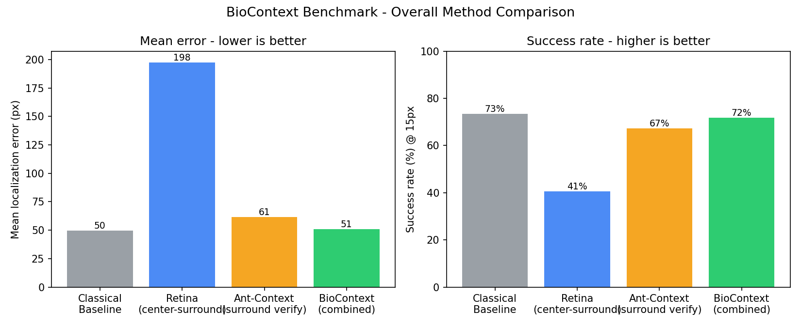
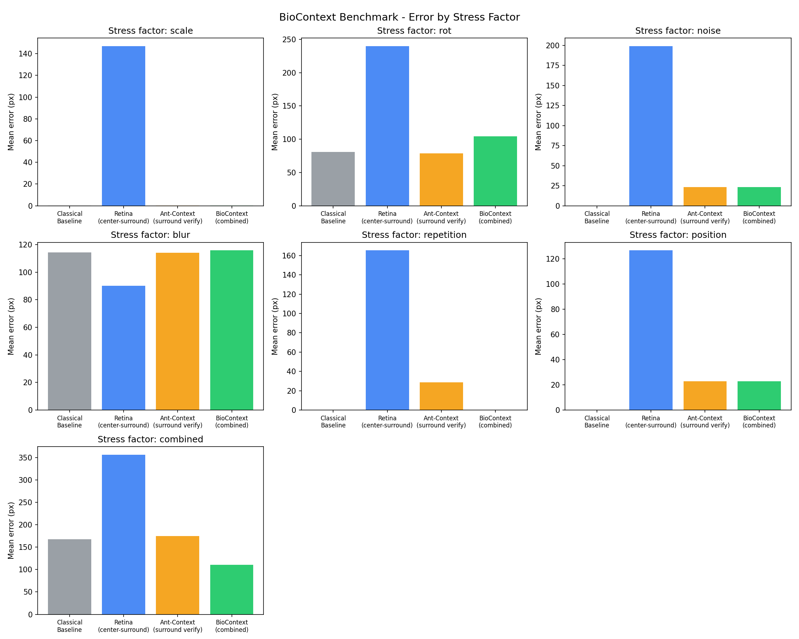
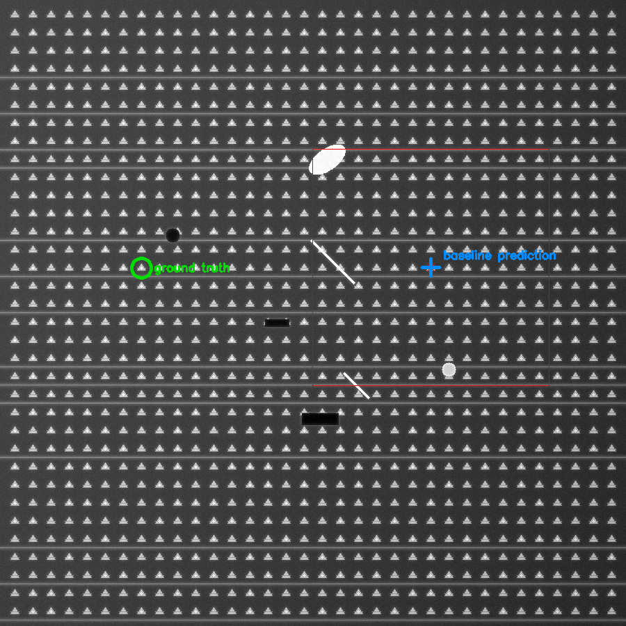
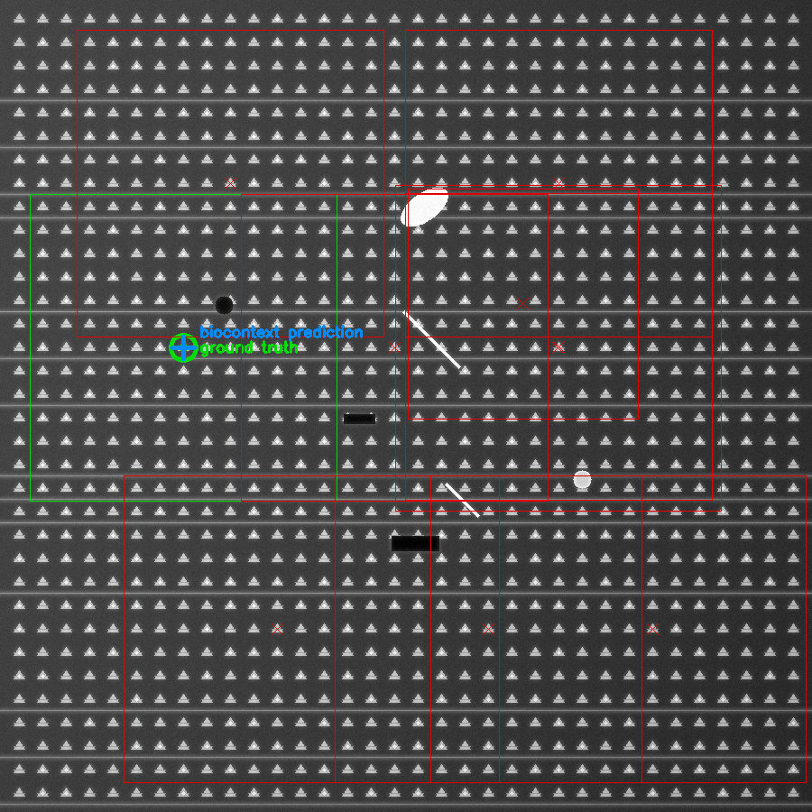

# BioContext - Drift-Sense

**Applied Materials SEMICON India Hackathon 2026 - Drift-Sense track**

BioContext locates a small, 10x-shrunk Reference Image inside a much larger
Search Image of wafer-inspection-style imagery, and is designed to resist
the false matches created by repetitive DRAM / FinFET periodic structure.

Repo: https://github.com/JudeAntony14/drift-sense-biocontext

---

## 1. The problem

Given:
- a Search Image (large field of view of a wafer inspection region), and
- a Reference Image that is a 10x shrunk crop of some location inside the
  Search Image,

recover the center coordinate `(x, y)` of the correct matching region in
the Search Image.

This is hard for two reasons:

1. Repetitive structure. DRAM bit-cell arrays and FinFET fin arrays are
   periodic by design, so the same local motif appears at hundreds of
   locations, and naive template matching regularly locks onto the wrong,
   visually identical cell.
2. Multiple plausible matches. When several locations score almost
   identically, a single "best peak" answer is fragile. The challenge asks
   for the center-most match to be preferred when several are found.

## 2. Our approach

We build a classical baseline first, then layer on two biologically
inspired mechanisms:

1. Retina-inspired center-surround processing. Retinal ganglion cells
   compute a narrow excitatory center minus a broader inhibitory surround
   (Difference-of-Gaussians). This whitens slowly varying, spatially
   repetitive structure and emphasizes locally distinctive micro-texture,
   which is what's needed to tell apart cells that otherwise look
   identical.
2. Ant-inspired visual navigation. Desert ants recognize a location by
   comparing the panorama around them to a remembered panorama, not by
   matching one ground-level snapshot. We use the same idea: instead of
   trusting a single best local match, we keep several plausible candidate
   locations and re-rank them by how well the surrounding context, not
   just the bare repeating motif, agrees with the reference's own
   surrounding context.

### Pipeline

```
Reference + Search
   -> multi-scale / normalized representation
   -> candidate generation (raw multi-scale NCC, non-max suppression, retain top-K peaks)
   -> retina center-surround rescoring (suppress periodicity, reward local distinctiveness)
   -> local structural matching (gradient/edge-based refinement per candidate)
   -> ant-inspired surrounding-context verification (score using the wider footprint, not just the motif)
   -> candidate ranking (center-most tie-break among near-equal candidates)
   -> final (x, y)
```

Four methods are implemented and benchmarked against each other:

| Method | What it uses |
|---|---|
| `baseline` | Classical multi-scale normalized cross-correlation (OpenCV `TM_CCOEFF_NORMED`), single best peak. No biology. |
| `retina_only` | Center-surround (DoG) preprocessing plus single best peak. Isolates the retina component. |
| `context_only` | Multi-candidate generation (raw pixels) plus ant-inspired surrounding-context verification, no DoG. Isolates the ant component. |
| `biocontext` | The full combined pipeline: candidate generation, retina rescoring, structural refinement, context verification, center-most tie-break. |

### Why candidate generation uses raw pixels, and DoG is a rescoring channel

An early version of this pipeline ran center-surround filtering before
candidate generation, and it measurably hurt accuracy. The reference is
captured at 1/10th resolution, so a tiny template correlated against a
heavily high-pass-filtered representation is dominated by a handful of
edge pixels and is very sensitive to small rotation or scale error. The
retina component works better as an independent evidence channel applied
after candidates are proposed: it tells you whether a candidate's
neighborhood shares the reference's non-periodic micro-structure, which
raw correlation alone cannot exploit. The ablations exist to show what
each biological component contributes, and where it does not help.

### Center-most match tie-break

When multiple candidates score within a small tolerance of the best score
and are spatially close to it, we return the candidate closest to the
centroid of that tied cluster rather than an arbitrary one. See
`biocontext/methods/common.py::pick_center_most`.

## 3. Repository structure

```
biocontext/
  data/synthetic.py      synthetic DRAM/FinFET-style dataset generator
  methods/
    common.py             shared types, center-surround, NCC, NMS, tie-break
    baseline.py            classical multi-scale template matching
    retina.py               ablation: center-surround only
    ant_context.py           ablation: candidate gen + context verify only
    biocontext.py             combined pipeline
  eval/
    benchmark.py           runs the controlled benchmark suite, saves CSVs
    plots.py                 generates comparison figures from the CSVs
  viz/visualize.py         candidate / false-match / final-selection overlays
  inference.py              CLI + Python inference interface
  demo.py                    one-command, screen-recordable end-to-end demo
tests/test_pipeline.py     smoke tests (dataset, all methods, tie-break)
results/
  tables/                  benchmark_raw.csv, benchmark_summary.csv, benchmark_by_factor.csv
  figures/                 generated comparison plots and demo visualizations
demo_output/                generated fresh each run of `python -m biocontext.demo` (gitignored)
requirements.txt
RUN_DEMO.md                 exact command sequence to record the demo video
```

## 4. Setup

```bash
git clone https://github.com/JudeAntony14/drift-sense-biocontext.git
cd drift-sense-biocontext
python3 -m venv .venv && source .venv/bin/activate   # optional
pip install -r requirements.txt
```

Python 3.9+ recommended. No GPU required, everything runs on CPU in
milliseconds per image pair.

## 5. Usage

### Demo mode (for recording a walkthrough video)

```bash
python -m biocontext.demo
```

Runs the full story end-to-end: dataset generation, reference/search
images, baseline vs BioContext, a four-way comparison grid, and a live
benchmark sweep. Every result is saved as a labeled PNG under
`demo_output/`. See `RUN_DEMO.md` for the exact command sequence.

### Run inference on your own image pair

```bash
python -m biocontext.inference \
    --search path/to/search_image.png \
    --reference path/to/reference_image.png \
    --method biocontext \
    --visualize out/prediction.png
```

Or from Python:

```python
from biocontext.inference import locate

result = locate("search_image.png", "reference_image.png", method="biocontext")
print(result.x, result.y, result.confidence)
```

`locate()` accepts either file paths or already-loaded numpy arrays, and
`nominal_scale` if your reference isn't shrunk by exactly 10x.

### Generate the synthetic dataset

```python
from biocontext.data.synthetic import CaseConfig, generate_case

case = generate_case(CaseConfig(seed=42, rotation_deg=5, gaussian_noise_std=6))
# case.search_image, case.reference_image, case.true_center, case.decoy_centers
```

### Run the full benchmark

```bash
python -m biocontext.eval.benchmark --n-per-factor 10
python -m biocontext.eval.plots
```

This regenerates everything under `results/tables/` and `results/figures/`.

### Run tests

```bash
python -m pytest tests/ -v
```

## 6. The synthetic benchmark

Real fab imagery is proprietary, so we built a controlled, reproducible,
procedural generator that reproduces the computational difficulty of
repetitive semiconductor layouts, without claiming physical accuracy:

- A large Search Image built from geometric primitives: a repeating
  DRAM/FinFET-style unit cell (identical motif at every grid position, the
  source of false matches), optional via/contact dots layered onto cells,
  optional repeated metal lines (bitline/wordline-style full-row strokes),
  plus a sparse set of larger, spatially unique context markers (analogous
  to rare defects or alignment features) that make each cell
  neighborhood's surrounding context locally unique even though the cell
  itself repeats everywhere. `CaseConfig.structure_type` selects `"cells"`,
  `"lines"`, `"vias"`, or `"mixed"`.
- SEM-like rendering effects applied on top (`CaseConfig.sem_effects`, on
  by default): a linear illumination gradient, radial vignette falloff,
  Canny-edge-based bright glow around structure boundaries (mimicking
  edge-charging effects in real SEM micrographs), and fine grain noise,
  independent of the structural Gaussian noise/blur applied to the
  reference. These are not meant to be physically accurate SEM captures;
  they make the imagery look like an inspection frame rather than a flat
  vector diagram, and add the kind of low-level nuisance variation a real
  detector has to be robust to.
- A Reference Image built by cropping a region around a chosen true
  location and shrinking it 10x, with independently configurable rotation,
  Gaussian noise, blur, scale-estimation error, and intensity gain/bias
  applied afterward.
- Every generated case also records the coordinates of visually identical
  decoy cells elsewhere in the image, so we know exactly how ambiguous
  each case is, and `save_case_artifacts()` writes the rendered
  Search/Reference PNGs plus a JSON ground-truth metadata file for every
  case, so every experiment can be inspected and reproduced without
  re-running anything.

The benchmark suite (`build_benchmark_suite`) sweeps 7 stress factors in
controlled isolation, `n_per_factor` cases each: scale error, rotation,
Gaussian noise, blur, repetition density (structural ambiguity), target
position (center, edge, corner, random), and a block of combined hard
cases stacking several nuisances at once. 64 cases total at the default
`n_per_factor=10`.

## 7. Results

Full run: `n_per_factor=10` (64 cases), success threshold 15px.

| Method | Mean error (px) | Median error (px) | Success rate @15px | Mean runtime |
|---|---|---|---|---|
| Classical baseline | 49.6 | 0.0 | 73.4% | 102 ms |
| BioContext (combined) | 51.0 | 0.0 | 71.9% | 108 ms |
| Ant-Context only | 61.4 | 0.0 | 67.2% | 104 ms |
| Retina only | 197.5 | 136.8 | 40.6% | 115 ms |



### By stress factor



Reading these honestly:

- On isolated, single-nuisance cases (scale error alone, noise alone,
  position alone, repetition alone) the classical baseline is already
  near-perfect, and BioContext matches it almost exactly. It is designed
  to fall back to baseline-equivalent behavior when the top match is
  unambiguous, not to override a confident correct answer.
- BioContext gives its clearest win on the `combined` block: multiple
  nuisances stacked at once (rotation, noise, blur, scale error, high
  repetition), which is the regime closest to a real noisy inspection
  scenario. Mean error 110.9px vs baseline's 167.8px, success rate 30% vs
  20%. This is where surrounding-context verification is supposed to
  help, and it does.
- On isolated rotation, the classical baseline and ant-context-only
  ablation are occasionally more accurate than the full combined
  pipeline, because a single strong raw-pixel peak is already a very good
  signal when rotation is the only nuisance. The retina (DoG) channel is
  somewhat rotation-sensitive at small kernel sizes and can inject noise
  into an otherwise easy decision. This is a genuine, documented
  limitation, see section 8.
- `retina_only` is consistently the weakest ablation on its own,
  confirming the design note in section 2: center-surround filtering is
  valuable as an auxiliary evidence channel, not as the sole basis for
  candidate detection on a tiny, 10x-shrunk template.

### Qualitative demo case, the headline scenario

A hand-picked hard case (seed 116): 92% repetition density, 3 degree
rotation, noise sigma 3, mixed cell/via/line structure, 1127 visually
identical decoy cells in the search image.

| Baseline (fooled by a decoy 416px away) | BioContext (exact recovery, 0px error) |
|---|---|
|  |  |

Both the classical baseline and the ant-context-only ablation lock onto
the same decoy in this case. Only the full combined pipeline (retina
rescoring plus context verification together) recovers the correct
location. Four-way side-by-side (baseline / retina-only / context-only /
biocontext) on the same case: `results/figures/demo_method_comparison.png`.

Additional figures: `results/figures/error_distribution.png` (box plots),
`results/figures/success_by_factor.png`, `results/figures/runtime_comparison.png`.

Raw per-case numbers: `results/tables/benchmark_raw.csv`.
Aggregate tables: `results/tables/benchmark_summary.csv`,
`results/tables/benchmark_by_factor.csv`.

## 8. Known limitations

- The dataset is synthetic. It is built to stress-test the specific
  failure mode described in the challenge (periodic structure plus
  shrunk reference), not to reproduce real SEM/optical-inspection pixel
  statistics. Swapping in real wafer crops behind the same `CaseConfig` /
  `GeneratedCase` interfaces is the natural next step.
- The retina (DoG) channel is somewhat sensitive to rotation at small
  kernel sizes; scale-adaptive or steerable filtering would likely close
  this gap (see `biocontext/methods/common.py::center_surround`).
- `pick_center_most`'s tie-break radius and score tolerance are fixed
  heuristics (`rel_epsilon=0.03`, `radius = 1.5x` bbox size), tuned
  qualitatively against the benchmark, not learned.
- Everything here is classical/deterministic computer vision, no learned
  weights, by design, for reproducibility and zero training-data
  dependency, but a learned scoring head over the same candidate/context
  features is an obvious extension.

## 9. Reproducibility

Every synthetic case is generated from an integer seed
(`CaseConfig.seed`); `build_benchmark_suite` assigns seeds
deterministically. Re-running `python -m biocontext.eval.benchmark`
regenerates identical `results/tables/benchmark_raw.csv` bit-for-bit on
the same package versions. All dependencies and exact versions used are
pinned as lower bounds in `requirements.txt`.

## 10. Team / hackathon context

Built for the Applied Materials SEMICON India Hackathon 2026, Drift-Sense
track. See `LICENSE` (MIT).
